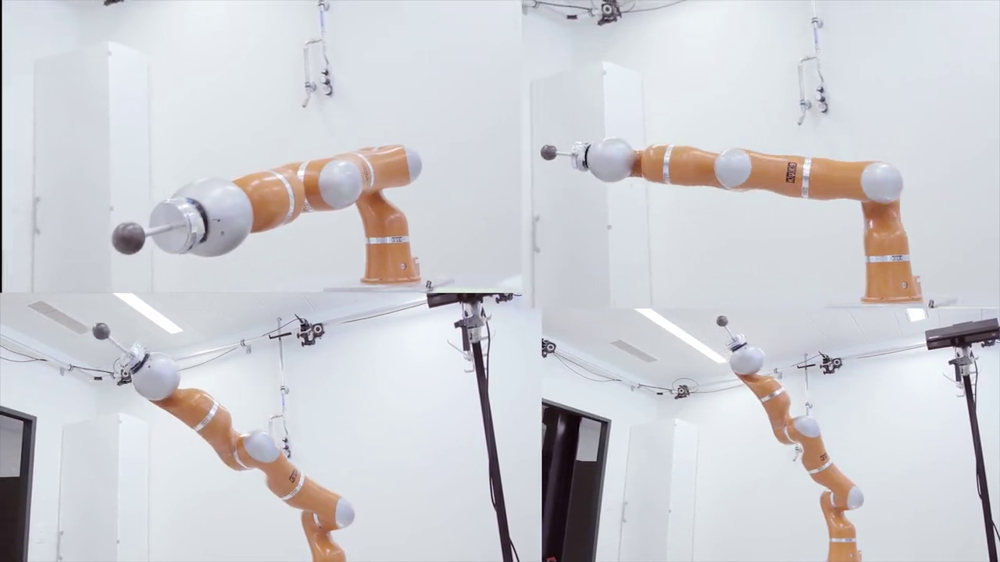

# JT-DS-lib


This repository includes the packages and instructions to run the JT-DS dynamical system, which introduced in "The Augmented Joint-space Task-oriented Dynamical System". You can find the paper here:

and the corresponding video here:
<div style="text-align:center">
[](https://youtu.be/1dgKfmN1UgE)

This research was conducted in the Learning Algorithms and Systems Laboratory (LASA) at the Swiss Federal Institute of Technology in Lausanne (EPFL) under the supervision of Prof. Aude Billard.  ---- http://lasa.epfl.ch/

# Dependencies 
	Mathlib form Robot-toolkit (https://github.com/epfl-lasa/robot-toolkit) 

# How to run

1. Initialization:

+  jseds::jseds(double dt_,int Num_C_,int Num_J_,int Num_Com_, Vector P_Joint_min_, Vector P_Joint_max_)
      dt_ is the sample time.
```
      Num_ Com_ is the number of the Gaussian components 
      Num_J is the number of the joints 
      Num_C_ is the dimension of the end-effector position
      P_Joint_min_ and P_Joint_max_ are the minimum and maximum of the joints positions.
```

+  jseds::initialize_P(const char *path_)
```
Is the path to the P matrix
```

+  jseds::initialize_A(const char *path_)
```
Is the path to the A matrices
```
+  jseds::initialize_GMM_Latend(const char *path_prior_,const char *path_mu_,const char *path_sigma_,const char *path_W_)
```
path_prior_ and path_mu_ and path_sigma_ are the paths to the Gaussian elements.

path_W_ is the path to the dimension reduction matrix.
```
2. In update loop:
+ jseds::Set_State(Vector P_END_,Vector P_Joints_,Matrix Jacobian_, Vector Target_)
```
P_END_ The current position of the end-effector
P_Joints_ The current position of the joints
Jacobian_ The current Jacobian matrix
Target_ The desired end-effector positions
```

3. jseds::Update()

4. jseds::Get_State(Vector &V_joints_,Vector &P_joints_New_)
```
V_joints_ The desired velocity of the joints
P_joints_New_  The desired position of the joints
```

Example of executions are available here:

